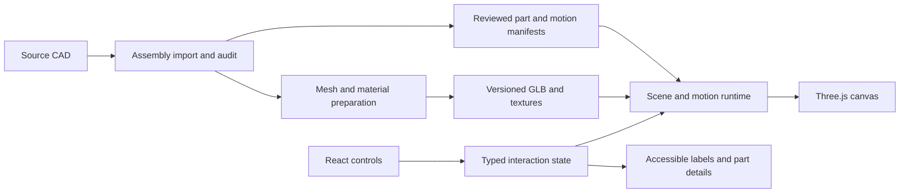

**Marco Lang ml-01 — interactive movement implementation plan**

Current scope decision, 9 September 2026: running/timing has been removed under the user-authorized static-explorer outcome. See `docs/ANIMATION_REVIEW.md` and `PROGRESS.md`. Playback ambitions and acceptance tasks below are historical planning, not remaining work for this local deliverable.

Prepared 8 September 2026. Status: implementation proposal; CAD inspection and performance measurements remain outstanding.

Execution update, 9 September 2026: source download, XCAF hierarchy extraction, and a single-component GLB/browser smoke test are complete. The full geometry audit, full-assembly rendering, and performance measurements remain outstanding. Follow PROGRESS.md and GOAL_PROMPT.md for the current starting point. The upcoming run is local-only; deployment and redistribution are deferred until the corresponding release gates are cleared.

**1. Product objective and working assumptions**

Build a visually exceptional, interactive explanation of the Zweigesicht-1 movement. Visitors should be able to appreciate the complete object, uncover its construction, inspect individual components, and understand selected mechanisms through motion with very little text.

The complete movement is the visual anchor. Guided transitions connect it to focused mechanism views. Free exploration remains available, with a predictable way back to the assembled watch.

Working assumptions: English first; public educational experience; desktop and touch devices are both core targets; no accounts; no commerce; mechanical fidelity matters, while engineering simulation is outside the initial scope. These assumptions can change without delaying the CAD audit.

Success means a visitor can uncover a mechanism, slow it down, identify a component, and return to the whole without assistance. Rendering all the parts is necessary but insufficient.

**2. Evidence and unresolved questions**

Verified from the maker’s published pages:

- The ml-01 specifications describe a 34 mm movement, 3 Hz balance, two barrels connected in series, displays on both faces, and an optional resettable shock indicator. These justify separate mechanism experiences. [Manufacturer’s specifications](https://www.marcolangwatches.com/en/watches/)
- The complete-watch download lists a 41.7 MB STEP file and a 144.62 MB STL file, alongside reference images. These are source sizes, not predicted web payloads. [Assembly download](https://www.marcolangwatches.com/cad/ml01-zweigesicht-2/)
- Marco describes Solid Edge as his authoring tool, STEP/STL as exchange formats, and acknowledges that CAD may differ from practical construction details. [CAD introduction](https://www.marcolangwatches.com/en/cad-2/)

The supplied [movement catalog](https://www.marcolangwatches.com/en/cad-2/zweigesicht-1/movement/) could not be fetched during planning. No CAD binaries have been inspected. The local project directory was empty before this plan.

Unverified: assembly hierarchy, instance count, unique part count, names, colors, units, placements, completeness, native constraints, spring geometry, exact variant, and correspondence between separate downloads and the assembly. Neither gear ratios nor pivot positions should be invented from screenshots.

The first milestone must replace these unknowns with an inventory, rendered evidence, and a revised estimate. Record source attribution and any supplied reuse terms with downloaded assets; resolve unclear redistribution terms before public asset distribution. This is a release task, not a reason to postpone the technical audit.

**3. Release scope**

| Capability | First polished prototype | Initial public release | Later expansion |
|---|---|---|---|
| Complete assembly context | Optimized real assembly | Complete movement; both-side views | Additional variants |
| Orbit, zoom, reset | Desktop and touch | Refined bounds and accessible controls | Optional advanced camera controls |
| Mechanism reveal | One difficult mechanism | Main functional groups from audited CAD | Additional narrated sequences |
| Running motion | One validated connected mechanism | Validated visible timekeeping chain | Winding/setting and additional conditional mechanisms |
| Explosion | One staged reveal | Layer separation and group-level part separation | Detailed disassembly sequences |
| Part inspection | Selected mechanism’s components | All imported components addressable | Manufacturing drawings and dimensions |
| Text | Short labels and one-sentence explanations | Brief optional details | Additional languages |
| Section cuts | Technical experiment only if needed | Authored cutaway where essential to explanation | General movable section plane |
| Shock indicator | Verify variant and geometry | Inspectable if present; static unless validated | Explicit shock/reset demonstration |

The initial public release includes the running-watch ambition. It is not complete if unexplained static components visibly interrupt a mechanism presented as running. A prototype may intentionally demonstrate only one mechanism and must be described accordingly.

Winding, setting, stopping, and shock response have different operating conditions. They should not be animated continuously simply because the watch is running.

**4. The interaction model**

The first screen gives most of its area to the movement. Keep visible controls limited to play/pause, mechanism selection, separation, side selection, and reset; expose speed and part details when relevant. Open directly on the object, without an introductory marketing screen or a required scroll sequence.

Three connected levels:

| Level | Visitor action | Scene response |
|---|---|---|
| Whole movement | Rotate, flip, select a mechanism, separate layers | Preserve orientation and overall shape |
| Mechanism | Reveal, slow, step, inspect a connected group | Frame useful contact points and remove obstructions |
| Component | Select a part, inspect its form and role | Highlight it and show a short caption; offer isolation |

Selecting a mechanism should highlight it before the camera travels. Obstructions move or disappear in an authored order. Keep nearby reference structures visible. Selecting a new mechanism during travel cancels the old destination and continues smoothly from the current visual state.

Back restores the preceding context, including the previous camera framing and separation state. Reset restores a documented default. Rotating manually takes control from camera animation immediately; the camera must not fight the pointer.

Mechanism concepts will be mapped to actual CAD IDs after inspection: energy storage, transmission, regulation/escapement, time display, winding/setting, and optional indication. These are visitor-facing groupings, which may differ from the source assembly tree.

**5. Visual direction and information density**

Use a restrained studio presentation: a deep neutral background, broad controlled reflections, clear separation of metal finishes, and a small accent palette reserved for selection and explanation. The actual CAD and reference photography determine the appearance. No generated substitute movement geometry.

Provide two treatments of the same scene:

- **Finish:** materials and lighting emphasize craftsmanship.
- **Function:** muted surrounding parts and consistent colors distinguish the active relationships.

Both treatments use the same geometry, animation time, selection, and camera. Switching treatment must not reset exploration. Highlights need outlines or other non-color cues.

Aim for labels of a few words and default explanations of roughly 15–30 words. Show at most three scene callouts at once. More detail is optional. Text remains available to accessibility tools even where animation conveys the main idea visually.

Prevent callout overlap with a screen-space layout pass. Hide labels occluded by foreground geometry instead of suggesting that hidden parts are exposed. Update anchors from current transforms, including during separation.

Avoid default full-scene transparency: overlapping surfaces can obscure depth and cause sorting artifacts. Prefer lifted bridges, hidden covers, and solid but subdued context. A short fade may connect two stable opaque states.

**6. CAD audit and recovery pipeline**

Use an offline conversion pipeline. Visitors receive prepared web assets; they do not parse large CAD files in the browser.

1. Inventory the assembly and component downloads. Preserve originals, URLs, hashes, file sizes, timestamps, and variant identifiers.
2. Import the STEP assembly through an assembly-aware Open Cascade XDE path, with FreeCAD available for inspection. XDE supports assembly placements and associated names/colors when those are present in the file; it cannot reconstruct information absent from the source. [Open Cascade XDE documentation](https://occt3d.com/dev/doc/overview/html/occt_user_guides__xde.html)
3. Distinguish reusable part definitions from placed component instances. A repeated screw needs a shared geometry definition and a unique selectable instance ID.
4. Export local and accumulated world transforms, bounds, names, material hints, and parent relationships. Normalize the source coordinate system once at the scene root; document millimeter-to-meter conversion.
5. Render assembled front, back, oblique, and side views. Compare silhouettes, dimensions, placements, and omissions with source references. Check for mirrored or double-applied transforms.
6. Inspect representative difficult geometry: thin spring, small pinion, jewel, polished bridge, and duplicated fastener.
7. Match separate part files only where the assembly requires supplementation. Match by geometry and placement evidence, not filename alone.
8. Produce an exception list and classify each issue as automatically recoverable, manually recoverable, or unresolved.

If STEP contains separate solids without useful hierarchy, construct an explicit mapping while preserving source transforms. If individual files use local origins, determine their assembly placements before export. Splitting an STL into disconnected islands does not reliably recover functional parts or a bill of materials.

Deliverables: `sources.json`, `assembly-manifest.json`, geometry statistics, reference renders, and `CAD_AUDIT.md` with an explicit proceed/revise decision.

**7. Mesh preparation and visual assets**

Tessellate selectively: large curved silhouettes need smooth contours; hidden mounting details can be cheaper; visible teeth and springs need preservation. Choose tolerances from projected error at planned close-up distances, then record conversion settings. Do not apply one destructive decimation percentage to every component.

Use Blender for material authoring, visual inspection, normal cleanup, and reviewed animation assets. Keep generated imports separate from hand-authored overrides so reimporting does not erase work.

Export GLB/glTF for runtime delivery. It is designed for runtime 3D asset delivery, and Three.js supports relevant loaders and compression integrations. [Khronos glTF](https://www.khronos.org/gltf/), [Three.js GLTFLoader](https://threejs.org/docs/pages/GLTFLoader.html)

Prepare an assembly overview asset and higher-detail mechanism assets. Overview geometry must retain the part identity needed for selection; component lists remain available before detailed geometry loads. Retire replaced meshes so overview and detail versions are not rendered simultaneously.

Use shared geometry for repeated parts. Instance identical renderable components where selection and separation can still map instance IDs correctly. Keep moving groups independent. Avoid optimization that merges away part identity, pivots, or custom metadata.

Choose Meshopt as the first compression candidate; compare size and decode behavior against alternatives on one representative asset. Use KTX2 textures where supported by the pipeline. Run optimization as explicit, reviewed transformations, then compare the resulting IDs, geometry, and renders against the unoptimized version. [glTF Transform CLI](https://gltf-transform.dev/cli)

For materials, begin with a small reusable set. Add directional brushing, detailed roughness, and more expensive transmission only where visible benefit is demonstrated. Three.js physical materials support anisotropy and transmission, with additional rendering cost. [MeshPhysicalMaterial documentation](https://threejs.org/docs/pages/MeshPhysicalMaterial.html)

Do not bake assembly-wide contact shadows into surfaces that will later separate. Evaluate any ambient occlusion in assembled and exploded views. Tune antialiasing and fine texture detail against shimmering in motion.

**8. Data contracts and transform ownership**

Keep four distinct structures: the source assembly tree, the functional grouping graph, the mechanical relationship graph, and the presentation/reveal graph. A single hierarchy cannot correctly express all four.

| Record | Required information |
|---|---|
| Source asset | URL, hash, format, units, variant, provenance |
| Part definition | Stable ID, geometry reference, material slots, source identity |
| Component instance | Stable ID, definition ID, parent, assembled transform, label |
| Mechanism | Member instances, context instances, connections, camera presets |
| Motion | Kind, axis/pivot frame, driver, ratio or curve, phase, evidence, review status |
| Reveal | Member transforms, order, paths, visibility, framing, captions |
| Quality asset | Detail level, bytes, triangles, required capabilities, replacement IDs |

Use stable IDs rather than mesh-array indices or display names. Version manifests and validate references during asset builds. Keep hand-reviewed mappings independent of generated IDs from import tools.

Compose transforms through named frames: assembled placement, presentation offset, mechanical pivot, animated rotation/deformation, and geometry-local correction. Define every frame’s coordinate space. Only the presentation controller changes reveal transforms; only the motion evaluator changes mechanical transforms. This prevents explosion and rotation from overwriting one another.

Keep assembled transforms immutable. Reassembly evaluates the original pose instead of attempting to reverse many accumulated position increments.

**9. Mechanical animation**

Build a deterministic pose evaluator driven by simulation time. Given the same timestamp and operating state, it returns the same pose regardless of frame rate or how the visitor reached that time.

Use one time source for a connected mechanism. UI easing has a separate presentation clock. Pause and seeking affect mechanical time; camera travel can continue while the mechanism is paused.

For each external meshing gear pair, derive the signed angular relationship from verified tooth counts. Wheels and pinions fixed to the same shaft share rotation. Resolve phase offsets and axis conventions explicitly. The simple relation `thetaB = phase - thetaA * teethA / teethB` applies only to the appropriate external mesh in consistent frames; internal meshes and other couplings require their own relationship.

Do not make the escape wheel rotate uniformly through a locked escapement. Author a reviewed cycle of lock, release, and impulse, and synchronize the connected train to that cycle where the motion is visible. Exact release timing, amplitudes, tooth counts, and lever geometry come from the audit and mechanical references.

The manufacturer’s published balance rate anchors the real-time cycle; slow motion scales the shared clock. A sinusoid may help a technical prototype, but it is not evidence of accurate contact behavior. Inspect extreme positions and release events individually.

Treat the hairspring as a separate deformation problem: preserve anchors, inspect the actual out-of-plane geometry, and validate motion without visible self-intersection. Prefer authored deformation or a constrained procedural representation. Label explanatory approximations in optional details. If adequate geometry is absent, record the reconstruction work rather than inventing a faithful-looking substitute silently.

Maintain a motion coverage table for every presented group: static by design, continuously driven, conditionally driven, approximation, or unverified. Mechanical review checks sign, ratios, phase, pivot alignment, and operating mode.

The optional shock demonstration needs an explicit input event and reset state. It must not respond to browser/device motion by default. Winding and setting demonstrations likewise require explicit operating modes and are later work unless the audit makes them inexpensive.

Handle tab suspension by freezing educational playback and rebasing elapsed time on return. Do not jump forward by minutes after a hidden tab resumes. Sample arbitrary timestamps for scrubbing; avoid numerically integrating hundreds of intervening steps.

**10. Reveal, explosion, and section behavior**

Implement separation in two scales: assembly layers, then components within the selected mechanism. Use authored travel directions and staging. Keep shafts and related parts visually aligned where that helps understanding.

Store separation progress as a normalized value and evaluate all transforms from it. Test both directions and interruptions. Frame the intermediate spread, not only the final endpoints. Use subtle guides only when alignment would otherwise be ambiguous.

Pause mechanical playback when a full explosion begins, preserving its phase. A focused mechanism can keep running while only its obstructing covers are lifted. Do not show separated, disconnected gears apparently driving each other without an explicit explanatory mode.

Explosion paths are presentation paths, not automatically validated assembly instructions. Keep that distinction in optional explanatory details; do not claim a service procedure.

Prefer authored openings for internal views. If a true cross-section is necessary, evaluate clipped geometry with visible caps and consistent picking. Three.js supports clipping planes, but closed, understandable cut surfaces and selection behavior require additional implementation. [WebGLRenderer documentation](https://threejs.org/docs/pages/WebGLRenderer.html)

An unrestricted slicing tool is deferred until a concrete explanatory need justifies its visual and performance cost.

**11. Application architecture**

Recommended runtime: React, TypeScript, Three.js, React Three Fiber, and a small typed state store. Use Three.js WebGLRenderer as the initial renderer; it requires WebGL 2. WebGPU is a future optimization option, not a launch prerequisite. [React Three Fiber](https://r3f.docs.pmnd.rs/), [WebGLRenderer](https://threejs.org/docs/pages/WebGLRenderer.html)

Use the supported Sites project scaffold when implementation begins, hosting the viewer as a client-side component. The graphics and motion modules should remain independent of the hosting framework. No database or application backend is needed for the initial product; asset hosting must be checked against actual deployment size limits.



React handles user intent and accessible controls. The frame loop updates object transforms directly without setting React state every frame. A single scene controller resolves camera, reveal, selection, and material state.

Explicit states include loading, whole, revealing, mechanism, part, and recovering. Playback and quality are independent state dimensions. Define permitted transitions and interruption rules instead of scattering booleans across components.

Suggested repository layout, to adapt to the generated starter:

```text
app/                         website entry and layout
src/viewer/                  scene, cameras, selection, materials
src/motion/                  pure pose evaluators and mechanical graph
src/experience/              state transitions, reveals, mechanism definitions
src/ui/                      accessible controls and part information
content/                     names, concise explanations, source references
assets/source-manifest/      provenance and source hashes
assets/authored/              material, pivot, and reveal overrides
scripts/cad/                 import and assembly extraction
scripts/assets/              export, optimize, validate, report
public/models/               generated runtime assets or asset manifests
tests/                       mechanical, interaction, and asset tests
docs/                        audit, decisions, QA evidence
```

Large original CAD and authoring binaries should use an appropriate artifact store or deliberate large-file workflow; do not accidentally commit all intermediate exports. Keep deterministic conversion settings and source hashes in version control.

**12. Loading, performance, and failure handling**

The following are initial engineering budgets, not measurements or promises. Ratify them after the full assembly benchmark, retaining the visual acceptance criteria if the numbers change.

| Measure | Initial target | Measurement |
|---|---|---|
| First useful still and controls | Within 2 seconds | Cold load, defined test network |
| Interactive overview | Within 8 seconds | 10 Mbps down, 100 ms RTT, no cache, representative phone |
| Overview transfer, including essential code/assets | Prefer 4–6 MB compressed | Network trace; prioritize the interaction budget |
| Extra detailed mechanism | Prefer 1–3 MB each | Asset report and incremental network trace |
| Desktop animation | Approximately 60 fps; p95 frame interval under 20 ms | 60-second scripted sequence on 60 Hz display |
| Baseline mobile animation | At least 30 fps; p95 under 40 ms | Actual device, including warm sustained run |
| Input response | Visible feedback within 100 ms | Selection and control interactions |
| Initial overview geometry | Investigate roughly 250k–600k visible triangles | Starting range only; profile materials and draw calls too |
| Asset lifetime | No growing resource count across 20 mechanism switches | Runtime counters and available browser memory tools |

Choose and record actual baseline devices at the first benchmark: an older supported iPhone, a midrange Android phone, and an integrated-GPU laptop. Test Safari, Chrome, and Firefox where relevant, including real iOS Safari. Device names and browser versions must accompany results.

Show a prepared view of the actual movement during loading; transition to the matching 3D camera. Load overview assets first and mechanism detail on demand. Provide honest progress states and retry actions. A failed optional detail load must not destroy the overview.

Use measured frame times to adjust pixel ratio, costly effects, and detail level with hysteresis. Preserve the active mechanism’s readable geometry before improving peripheral detail. Avoid visible quality oscillation.

Pause rendering while hidden; render on demand when mechanical and presentation motion are stopped. Limit high-resolution textures and transmission surfaces. Prewarm important shaders where feasible. Explicitly dispose resources when no longer needed without deleting shared assets still in use.

Test a five-minute session for thermal degradation. A screenshot and a momentary frame-rate reading are insufficient. If WebGL 2 is unavailable or context restoration repeatedly fails, retain a useful static view with accessible mechanism explanations and a clear indication that interactive 3D is unavailable.

**13. Mobile and accessibility**

On phones, use a compact bottom panel that can collapse without changing the camera unexpectedly. Compute framing from the unobscured viewport, accounting for panels and safe areas. Portrait use must be viable; landscape is optional.

Use tap for selection, one-finger drag for orbit, and pinch for zoom with a movement threshold that prevents accidental selection. Provide visible zoom/reset controls too. Tiny parts are also reachable through their mechanism’s part list. Use larger invisible pick targets carefully so neighboring targets do not steal selection.

Support keyboard navigation, visible focus, labeled sliders, button alternatives to drag, and DOM-based descriptions. Avoid focus traps in the canvas. A screen-reader user should be able to select a mechanism and access its component relationships without interpreting the rendered image.

For reduced motion, start paused and use immediate or short low-motion framing changes. Pause remains available at all times. Do not autoplay sound. Test text enlargement and narrow viewports as part of the first working slice.

**14. Authoring workflow and content validation**

For each mechanism, author one compact specification: purpose, exact members, obstructions, best viewing angle, pose extremes, operating mode, short caption, interaction, and exit path.

Build a development-only inspection panel after the first manual reveal proves useful. It should expose IDs, pivot axes, playback phase, camera capture, and reveal progress. Store reviewed values in files. Avoid investing early in a general-purpose editor.

Keep a confidence/evidence field for mechanical claims and motion parameters. Geometry can suggest an axis but does not prove a ratio, constraint, or operational sequence. Escapement and spring behavior should receive review from someone able to assess the mechanism, supported by CAD, maker references, or suitable recordings. If that expertise is unavailable, keep the release’s fidelity claims bounded to what has been verified.

Create reference screenshots and short recordings of the actual browser implementation. Use these for consistency between mechanisms and to review interruption behavior, contact timing, and visibility.

**15. Delivery phases, dependencies, and estimates**

Estimates below are person-days of focused work, including review and iteration. They assume usable source geometry and access to the relevant CAD, graphics, and mechanical skills. They are a planning range, not a delivery commitment. They supersede the earlier informal estimate by including the expanded scope and explicit QA.

| Phase | Work and concrete output | Depends on | Effort |
|---|---|---|---|
| A — audit | Recover assembly, inventory parts, validate views, identify unknowns | Source access | 3–5 days |
| B — decisive prototype | Full context, finished materials sample, one difficult running reveal, touch controls, measurements | A | 7–12 days |
| C — explorer foundation | Reliable state/camera behavior, two-level explosion, complete part addressing, responsive UI | B acceptance | 8–12 days |
| D — mechanical coverage | Verified connected running chain, motion coverage, mechanism-specific reveals | A graph and B animation proof | 15–25 days |
| E — visual and explanatory refinement | Consistent materials, all release mechanism experiences, concise labels, user testing | C and progressive D outputs | 7–12 days |
| F — release qualification | Device QA, optimization, accessibility, failure recovery, deployment verification | C–E | 5–8 days |

Total base effort: approximately 45–74 person-days, or 9–15 full-time person-weeks. Reserve roughly 25% additional effort for CAD repair and iteration until A and B reduce the uncertainty. Calendar time depends on staffing and review availability; adding developers does not remove the mechanical-authoring dependency.

Required capabilities: web/3D engineering, CAD and material preparation, interaction design, and mechanical review. One person may cover several, but the work and review still have to happen.

Dependencies allow interface construction and asset preparation to overlap after stable IDs and coordinate conventions are established. Do not expand to all mechanisms while the decisive prototype still fails readability or device performance.

**16. Acceptance gates**

**Gate A — source viability:** the assembly’s dimensions and major placements match references; components are separately addressable; missing or uncertain geometry is listed; conversion can be repeated. If substantial reconstruction is needed, revise scope and effort using the actual exceptions.

**Gate B — experience viability:** the full assembly is recognizable; one dense mechanism can be revealed and understood; motion is coherent; mobile controls work; performance is measured. Ask five representative visitors to reveal the mechanism, slow it down, identify the active component, and restore the whole. Target at least four completing the sequence without coaching. Treat this small study as formative evidence, not statistical proof.

**Gate C — release readiness:** all included groups have reviewed reveals and motion classifications; no known incorrect visible mechanical relationships; all imported parts map to the catalog or an explicitly documented exclusion; target-device QA passes; loading failures and reduced motion work; deployed asset paths and cache behavior are verified.

If a gate fails, improve the affected mechanism or pipeline before adding breadth. If global geometry is too heavy, revise overview/detail delivery. If polished materials hide motion, change the explanatory treatment. If a mechanism needs different viewing geometry, author a dedicated contextual view.

**17. Verification plan**

Automated checks should protect meaningful invariants:

- Asset validation: unique IDs, valid references, finite transforms, units, nonempty geometry, required mechanisms, and preserved IDs after optimization.
- Mechanical validation: verified ratio/sign relationships, pose periodicity where appropriate, phase boundaries, deterministic seeking, and shaft coupling.
- Presentation validation: reassembly restores original transforms; reveal interruption does not jump; reset restores all relevant state.
- Browser workflows: load, select, reveal, seek, switch mechanism during travel, explode, reassemble, flip, reset, and retry a failed detail request.

Use tolerance-based comparisons for floating-point transforms and visual diffs. Avoid brittle cross-device pixel equality. In a controlled browser, capture selected views at fixed timestamps and separation amounts; then visually review contact events and geometry artifacts.

Maintain a QA matrix covering desktop pointer, phone touch, keyboard, reduced motion, text enlargement, slow network, detail-load failure, context loss, orientation changes, and repeated navigation. Performance traces and real-device observations belong with the release evidence.

**18. Risks and explicit responses**

| Risk | Early signal | Response |
|---|---|---|
| Lost assembly structure | Flat unnamed solids or inconsistent origins | Recover placement/identity mapping before animation |
| CAD and finished watch differ | Missing engraving, finish, spring, or variant components | Record source fidelity; author justified additions separately |
| Mechanical graph unclear | Unknown tooth counts or contact sequence | Research/review the affected relationship; defer fidelity claims |
| Detail harms performance | Decode stalls, shimmering, excessive draw calls | Selective tessellation, shared assets, on-demand detail |
| Finish obscures the action | Visitors cannot identify moving contact points | Function treatment, new light rig, better framing |
| Explosion becomes confusing | Lost alignment, parts offscreen | Grouping, staged paths, paused motion, contextual return |
| Transparency destroys depth | Sorting artifacts or overlapping silhouettes | Opaque context, removal, or limited authored cutaway |
| Authoring cost grows per mechanism | Each reveal requires bespoke code | Move repeated parameters into tested data contracts |
| Mobile thermal or memory problems | Degradation during sustained sessions | Lower effects/detail, release resources, repeat device testing |

**19. Deployment and reproducibility**

When implementation reaches release readiness, use the Sites build and hosting workflow. Validate actual asset-size constraints early in phase B; use supported object storage/CDN delivery if required by the payload. Keep source CAD out of the public runtime bundle unless intentionally offered for download.

Use content-hashed asset URLs and a versioned manifest. Publish a matching application/manifest/assets set atomically where supported; retain the previous deploy for rollback. Verify cold loading, direct navigation, compressed assets, decoder delivery, and cross-origin headers on the deployed site.

Keep dependency lockfiles, conversion tool versions, source hashes, and asset-generation commands. A clean checkout plus documented source retrieval should reproduce the runtime assets without losing hand-authored annotations.

For repository publishing, use git over the configured SSH remote for local operations and push. Use the connected GitHub app for PR and API actions. Do not use `gh`; report an unavailable SSH remote or GitHub connection specifically.

**20. First execution backlog**

The backlog below records the original sequence. Source retrieval and the initial hierarchy probe have since passed preflight; resume with the assembled reference views and full audit described in PROGRESS.md.

| ID | Task | Completion evidence |
|---|---|---|
| A01 | Retrieve assembly and movement catalog; record provenance | Download manifest and hashes |
| A02 | Import STEP and extract definitions/instances/transforms | Machine-readable inventory and import log |
| A03 | Validate assembled views and exact variant | Reference comparison renders and exceptions |
| A04 | Map functional groups and identify the hardest representative reveal | Part-ID map and mechanism choice rationale |
| A05 | Convert overview and representative fine components | Web geometry statistics and visual comparison |
| B01 | Establish viewer and actual-device benchmark | Browser view of the full assembly and baseline trace |
| B02 | Finish representative materials and lighting | Assembled and close-up renders in both treatments |
| B03 | Author one dense reveal and return sequence | Continuous interaction recording |
| B04 | Build and validate that mechanism’s motion evaluator | Reviewed parameters, deterministic playback tests |
| B05 | Add pause, slow motion, seeking, and part selection | Working desktop/touch interaction |
| B06 | Test comprehension and sustained performance | Gate B report and revised remaining estimate |

The first decisive deliverable is a real-CAD, full-context mechanism experience with measured performance and demonstrated clarity. Its purpose is to prove the central promise before scaling the authoring effort to the rest of the watch.
