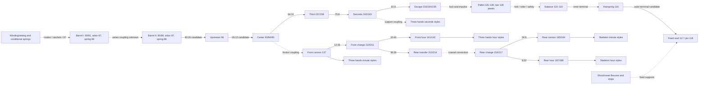

# M0 — Evidence and coverage checkpoint

12 September 2026, version 1. **M0 complete as an evidence checkpoint; M1 is ready for a bounded foundation task only.** No running mechanism is mechanically accepted. Validation tolerances are proposed, not externally agreed. The current viewer, source assets, fitted displays and retired motion configuration are unchanged.

## Deliverables and coverage

- [Versioned component inventory](coverage.csv): all 426 current instances, including 365 leaves and 61 assemblies, each with stable runtime ID, exact source occurrence/definition, motion class, condition, rationale, evidence ID, confidence, review status, source URL and SHA-256.
- [Mechanical graph](graph.json): 35 nodes and 37 typed relationships, with exact instance membership, candidate ratios, operating conditions, unresolved/rejected edges, six historical shaft axes, spring geometry and all 15 fitted hand mappings.
- [Unknowns and review register](UNKNOWNS.md): verified findings, assumptions and external-review questions remain separate.
- [Proposed tolerances](TOLERANCES.md), [M1 implementation brief](M1_BRIEF.md), [coverage reconciliation](coverage-summary.json) and [scalar CAD evidence](probe-summary.json).

| Motion class | All instances | Leaves | Meaning |
| --- | ---: | ---: | --- |
| Fixed | 257 | 257 | Stationary in the stated normal-running scope; includes case/strap context. Many are role-based assumptions, not certified fastenings. |
| Continuously driven | 73 | 61 | Participates throughout normal running, including oscillating or escapement-gated motion; does not mean constant angular velocity or established driver. |
| Conditionally driven | 26 | 22 | Winding, setting, correction, shock or reset; mode and possible back-drive remain open. |
| Deforming | 12 | 12 | Hairspring, two mainsprings and nine conditional spring occurrences; no deformation law accepted. |
| Unresolved | 58 | 13 | Includes 45 mixed/unproven source assemblies; these must not receive blanket rigid motion. |

The 13 unresolved leaves are eight drum/cover/arbor/ratchet occurrences, washer 121, two indicator washers 164 and two loose hand alternatives (13/16). The two mainsprings are classified deforming even though their host/operating laws remain unresolved. Empty STEP diamond 225 retains its fixed instance identity; the later maker-STL recovery does not add a catalog occurrence. See [appearance audit](../COMPONENT_APPEARANCE_AUDIT.md). The root is a non-component container and is excluded from 426, matching the source catalog.

Coverage is deliberately broader than the active viewer's selected leaves. Raw alternatives remain covered even when excluded from fitted presets. Fitted hand coverage is 15 unique blades and seven shared support occurrences, across Three hands Fine/Lance/Open lance and Skeleton Lance/Broad lance/Pear. Three hands has hours/minutes/seconds; Skeleton has hours/minutes. Independent visibility and style selection are retained. Assembly rows are accounting entries, not extra mesh transforms.

## Evidence index

| ID | Source | What it supports / limit |
| --- | --- | --- |
| E-CAD | [Source manifest](../../assets/source-manifest/sources.json), [runtime catalog manifest](../../explorer/public/models/assembly-manifest.json), [CAD audit](../CAD_AUDIT.md) | Exact source identities, names, placements and geometry; no recovered native kinematic constraints. Per-row maker links identify the source assembly, not a new mechanical assertion. |
| E-MECH | [Mechanical review](../MECHANICAL_REVIEW.md), [retired evidence](../../assets/authored/motion-evidence.json) | Six axes, rigid membership, 11 counts and spring terminals; historical engineering evidence, never an active parameter preset. Manufacturer 3 Hz and series-barrel statements are inherited recorded reference findings, not newly researched specifications. |
| E-ANIMATION | [Animation review](../ANIMATION_REVIEW.md) | Ten prior omissions, missing upstream barrel/display paths, incorrect completion claims and source/operating pose distinction. |
| E-HANDS | [Hand time review](../HAND_TIME_REVIEW.md), [hand poses](../../assets/authored/hand-display-poses.json), [dial configurations](../../assets/authored/dial-configurations.json), [independent dial review](../INDEPENDENT_DIALS_REVIEW.md) | Fitted bores, supports and Lance correction; static fit is not drive/contact validation. Earlier exclusive-dial behavior is superseded. |
| E-PROBE | [M0 scalar probe](probe-summary.json), [probe script](../../scripts/mechanics/m0_probe.py), [reduction script](../../scripts/mechanics/m0_summarize.py) | Fresh source-hash-checked counts, analytic cylinder candidates, axis-distance checks and topology tolerance maxima; no mesh-phase or continuous collision solution. |

## Relationship graph and intended paths

Arrows below mean the labeled relationship, not necessarily a verified energy direction. Dashed paths are unresolved couplings. `graph.json` is the detailed authority, including the explicitly rejected barrel-I direct output edge. All angle signs use common right-handed STEP world +Z, lengths mm. Source local Z directions and screen-facing direction must not supply the sign implicitly.



The energy path is **series barrels → drum II 85 → 96 → center → third → seconds → escape → pallet → balance**, with spring restoring action linking balance to the frame. It remains incomplete at the series connection and contact cycle. The graph does not invent a torque law or make wheel 97 the missing series link. Its measured location makes that casual inference unjustified; its coupling/setting role stays conditional and unresolved.

The display branches are center → front cannon → front hour reduction, seconds → central seconds support, and front change → rear transfer → rear change → rear minute/hour outputs. Under candidate rigid coupling of 214 to 215, front hour/front minute = +1/12; rear minute/front minute = −1; rear hour/front minute = −1/12. These are count-derived signed delta relations, not validated tooth phase, actual running direction or proof of press/friction couplings. Opposite viewing sides can then display the same advancing time. Do not merge minute and seconds shafts because both share XY (0,0).

Both ratchets 131 are separate occurrences. Their observed axes associate P14 with barrel I and P15 with barrel II, contrary to any assumption based on enumeration order. P14's placement is offset from the barrel-I axis by about 0.007071 mm; this is a source-placement candidate discrepancy requiring bore/fit review, not permission to recenter source CAD. Each barrel's drum/cover, arbor, ratchet and spring must retain independent ownership until reviewed. Inner and outer mainspring attachment frames are still missing.

## Bounded probe findings

The original STEP hash was reverified as `f34148903818c273e20deeb0e70d3dc7782e08a413bc0e420f30d8c209aa4a2b`. Catalog occurrence sets match the existing preflight inventory, and every world-matrix entry agrees within the proposed 1e-10 budget. Input hashes are retained in the coverage summary. Source URLs/hashes remain unchanged in `assets/source-manifest/`.

The fresh probe covers 24 selected definitions. Fifteen toothed definitions agree at all three radial thresholds: 85/90=80, 93=12, 96=26, 97=17, 131=62, 137=12, 141=40, 183=8, 187=32, 210/213=36, 211=10, 216=24 and 217=8 teeth. The 11 historical counts were independently recomputed from the existing sampled-edge cache, including the **20-tooth escape wheel**. The cached data is historical, not a fresh STEP extraction; fresh overlap checks on 85/90/93/96 agree. Algorithmic threshold agreement is geometric corroboration, not expert tooth-by-tooth acceptance.

| Candidate pair (definition IDs) | Axis distance / mm | Label-derived nominal / mm | Interpretation |
| --- | ---: | ---: | --- |
| Barrel II 85 → 96 | 7.950000 | 7.950000 | Supported output candidate |
| Barrel I 90 → 96 | 11.386086 | 7.950000 | Reject direct external pair |
| 96 → center 93 | 2.850000 | 2.850000 | Restores previously omitted upstream link candidate |
| Front cannon 137 → 210 | 4.250000 | 4.248000 | 0.002 mm residual; source module label precision can account for it; phase/fit still open |
| 211 → front hour 141 | 4.250000 | 4.250000 | Front 12:1 reduction candidate |
| Front 210 → rear transfer 213 | 6.372000 | 6.372000 | Cross-face transfer candidate |
| Front cannon 137 → 213 | 5.000000 | 4.248000 | Reject direct external pair |
| Rear 216 → 183 | 2.400000 | 2.400000 | Rear minute output candidate |
| Rear 217 → 187 | 2.400000 | 2.400000 | Rear hour reduction candidate |

Analytic axial cylinders support these local-origin axes. Rear transfer 214 and rear change 216/217 share world XY (0,5) mm, but coaxiality does not prove their connection. Rear cannon/hour axes are (0,7.4) mm, matching existing fitted Skeleton supports. Gear layer overlap, flank geometry, absolute direction and phase remain unchecked.

**Precision finding:** maximum stored face/edge/vertex tolerances are 0.008430963 mm for spring 116, 0.004160166 mm for stud 117, 0.003888257 mm for coupling 97, 0.003023561 mm for center pinion 93, 0.002291752 mm for drums 85/90 and 0.001372533 mm for pinion 211. These maxima do not prove that a particular terminal/contact is inaccurate, but they prevent treating every source face as a 1 µm reference without a local audit. The previously proposed budget remains unchanged; affected classifications are inconclusive pending local precision/convergence evidence. The known non-fatal `FixShape … gp_Dir2d() … zero norm` import diagnostic recurred. No CAD repair was attempted.

The hairspring is a 0.035 × 0.215 mm ribbon with a raised overcoil and about 0.680 mm Z extent. Terminal center evidence does not provide complete clamp frames. Two occurrences of stud 117 exist under different source parents; the exact fixed attachment must be resolved geometrically. Historical sparse contact distances are insufficient to choose bank angles or a collision-free path. The old ±180° amplitude, +escape direction, 0/−12° pallet endpoints and 42–58% release window remain rejected as validated operating parameters.

## Reproduction and verification

From the repository root, using the existing local CAD/environment:

```sh
.venv-cad/bin/python scripts/mechanics/m0_probe.py
.venv-cad/bin/python scripts/mechanics/m0_summarize.py
python3 scripts/mechanics/m0_inventory.py --check
python3 scripts/mechanics/m0_verify.py
git diff --check
```

The first command reimports the verified STEP and writes only ignored `artifacts/mechanics/running-movement/m0/cad-probe.json`; the second retains scalar results and verifies historical counts from the existing edge cache. If that cache is absent, regenerate it with `scripts/mechanics/probe.py` as documented in the [probe README](../../scripts/mechanics/README.md). No downloads, new packages, original CAD commits or viewer assets are needed. The output log remains local at `artifacts/mechanics/running-movement/m0/cad-probe.log`. Generator mappings live in `m0_inventory.py`; regenerate without `--check` only after reviewing source-specific decisions.

Verification checks the complete 426-ID census, definitions/transforms against preflight, valid graph references, all fitted style memberships, count reproducibility, graph path ratios and rejected candidate evidence. It checks linked local deliverables and input hashes. The viewer is preserved by a zero diff under `explorer/`, existing authored assets and source manifests; no browser/build result is claimed for this evidence-only checkpoint.

Next recommended action: authorize M1's isolated deterministic harness using explicit unresolved contracts. Prepare a focused external review packet for series-barrel operation, escapement source-rest/contact phases and spring terminal/precision evidence before attempting M4 acceptance. Do not start by reviving the retired timing study.
